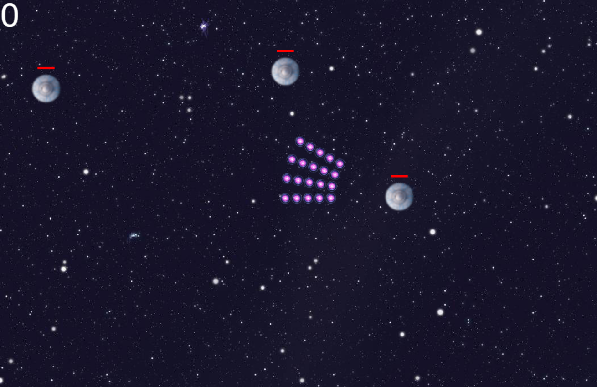

#
	Jogos Digitais - Unisinos 2018/02
	Computer network.
	Studant: Guilherme Brendel
	Professor: Marcio Garcia Martins.
#

#Discotopia
This is a multiplayer web game using Node.js

you can play it on: https://discotopia.herokuapp.com/

This project is based on a (awesome) tutorial, available at: https://www.youtube.com/watch?v=PfSwUOBL1YQ&t=5s

#Screenshot


## Setup
Clone the github repository, and then run the following steps:
```bash
npm install         ## installs the nodejs dependencies
node app.js         ## runs the development server locally
```

## Known issues

It will give you error messages if Grammarly extension is installed in your chrome browser.
If you are holding a movement button, change tab and then release the button, the player will continue to move, this happens because the client did not send the release event to the server.
